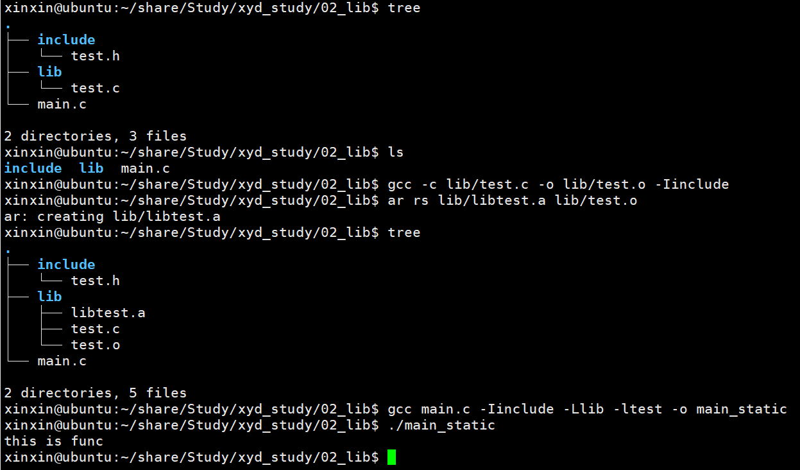
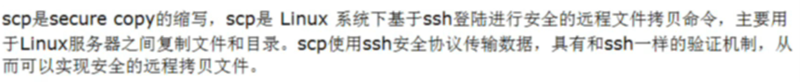
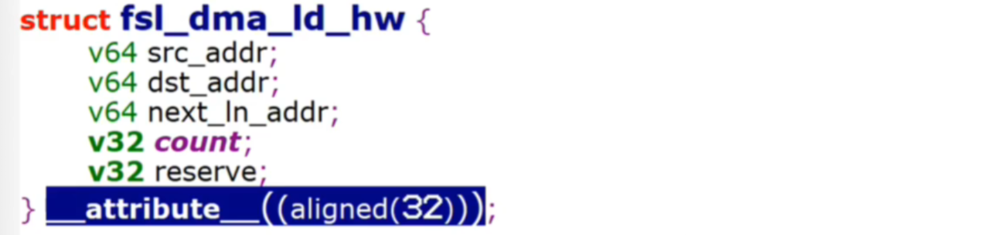

# GCC编译器

## 编译过程


gcc main.o -o main：动态链接，把要用到的接口信息链接到文件里，就是告诉你接口在哪，在哪个so或哪个.c里，把接口位置信息或者说路径信息记录下，在程序执行的时候才打开库文件并载入库文件中的相应函数接口，该种方法生成的可执行程序比较小，同时，在程序有bug时，定位到某个库文件，只需要替换相应的so文件就可以了，不需要替换整个可执行文件，但是缺点也是显而易见，在程序部署的时候必须确保环境的库文件版本正确，否则程序无法运行

gcc main.o -o main -static：静态链接，会把接口所在的库直接拿过来编在一起，注意，这里不是只拿对应接口实现，而是是把整个库拿过来，不管你用到没用到，相当于整个静态库的内容都会被链接到代码中。优点就是编译后的可执行程序不依赖任何外部的库文件，这点可以很好的保证程序的可部署性，因为不用再考虑库的兼容性和依赖性，其缺点也是显而易见，编出来的可执行文件会有点大，还有就是对库做的修改，必须重新编译整个可执行文件，升级也需要替换整个可执行文件

## 常用参数


## 制作静态库并使用



gcc main.c -o main -ltest -static

## 制作动态库并使用


# Linux常用传输工具


## ftp

我们用的xfpt以及FileZilla软件，在windows上装的是客户端，虚拟机上装的是服务器，可以支持ftp以及sftp，但我们常用的是sftp

## tftp

ftp用的是tcp协议，tftp用的是udp协议，tftp比较小，比较简洁，它相当于是轻量级的ftp

## sftp

对于sftp，前面那个s是secure，安全的意思


## scp



跟cp命令很像，有两个参数嘛，cp src des

scp src des

从ip为47.101.128.140的主机上，把/root/test.c文件拷贝至当前位置


将当前路径下的uImage文件拷贝至ip为47.101.128.140的主机上的/root/目录下


# Linux常用命令

## umask

将umask值临时地改变成0，重启后会失效

umask 0

## file

查看文件类型

file 文件名

## head

查看文件前10行

head -n 10 test.txt

head --line=10 test.txt

## tail

查看文件后10行

tail -n 10 test.txt

tail --line=10 test.txt

## find

用于查找文件

基本格式：find 搜索路径 [选项] 搜索内容，如find /usr/lib/x86_64-linux-gnu/ -name "libc.so"

## grep

用于查找文件中的关键字

基本格式：grep 关键字 文件名 [选项]，如grep "helloworld" ./*，但这样不会递归地去查找，只会在当前目录下的文件内去查找，如果要递归查找，那就grep "helloworld" -rn

# 内存泄漏检测工具valgrind


```c
#include <stdio.h>
#include <stdlib.h>

int main()
{
    //内存泄漏
    char *p1 = (char *)malloc(sizeof(char) * 128);

    //越界访问
    int *p2 = (int *)malloc(sizeof(int) * 5);
    p2[5] = 1;
    free(p2);

    //使用未初始化的内存
    char *p3;
    char ch = *p3;

    //使用已经释放的内存
    char *p4 = (char *)malloc(sizeof(char) * 8);
    free(p4);
    p4[0] = 'a';

    return 0;
}
```

1、gcc main.c -o main -g

2、使用valgrind ./main启动程序，最前面一列表示进程的进程号

```
xinxin@ubuntu:~/share/Study/xyd_study/10_valgrind$ valgrind ./main 
==4363== Memcheck, a memory error detector
==4363== Copyright (C) 2002-2017, and GNU GPL'd, by Julian Seward et al.
==4363== Using Valgrind-3.13.0 and LibVEX; rerun with -h for copyright info
==4363== Command: ./main
==4363== 
==4363== Invalid write of size 4
==4363==    at 0x1086B6: main (main.c:11)
==4363==  Address 0x522f114 is 0 bytes after a block of size 20 alloc'd
==4363==    at 0x4C31B0F: malloc (in /usr/lib/valgrind/vgpreload_memcheck-amd64-linux.so)
==4363==    by 0x1086A9: main (main.c:10)
==4363== 
==4363== Use of uninitialised value of size 8
==4363==    at 0x1086CC: main (main.c:16)
==4363== 
==4363== Invalid write of size 1
==4363==    at 0x1086F0: main (main.c:21)
==4363==  Address 0x522f160 is 0 bytes inside a block of size 8 free'd
==4363==    at 0x4C32D3B: free (in /usr/lib/valgrind/vgpreload_memcheck-amd64-linux.so)
==4363==    by 0x1086EB: main (main.c:20)
==4363==  Block was alloc'd at
==4363==    at 0x4C31B0F: malloc (in /usr/lib/valgrind/vgpreload_memcheck-amd64-linux.so)
==4363==    by 0x1086DB: main (main.c:19)
==4363== 
==4363== 
==4363== HEAP SUMMARY:
==4363==     in use at exit: 128 bytes in 1 blocks
==4363==   total heap usage: 3 allocs, 2 frees, 156 bytes allocated
==4363== 
==4363== LEAK SUMMARY:
==4363==    definitely lost: 128 bytes in 1 blocks
==4363==    indirectly lost: 0 bytes in 0 blocks
==4363==      possibly lost: 0 bytes in 0 blocks
==4363==    still reachable: 0 bytes in 0 blocks
==4363==         suppressed: 0 bytes in 0 blocks
==4363== Rerun with --leak-check=full to see details of leaked memory
==4363== 
==4363== For counts of detected and suppressed errors, rerun with: -v
==4363== Use --track-origins=yes to see where uninitialised values come from
==4363== ERROR SUMMARY: 3 errors from 3 contexts (suppressed: 0 from 0)
```

评论：这东西在实际工作中，用途其实接近于0，大部分项目的大部分功能，模块都是异步的，内部各种消息，信号满天飞，这边申请，那边释放，很少在一个调用栈内申请释放

# man手册


如：

man 1 ls

man 2 open

man 3 fopen

man手册都是英文的，也可以安装中文版本的

安装命令：sudo apt install manpages-zh

查看：如man -M /usr/share/man/zh_CN/ 2 open

但是中文版的内容没有英文版全面

# 交叉编译

先在PC端写个hello.c


然后用ubuntu自带的gcc编译器编译，生成的二进制文件在PC端可以正常运行


然后把可执行文件下载到开发板上，再次运行，提示格式错误


用file命令查看一下文件的属性


很显然，它属于x86架构，而我们用的开发板是ARM架构的，虽然都是二进制文件，但并不是在所有的平台上都是通用的，所以下面就需要解决一个问题，如何在电脑上编译代码，然后让它在开发板上能运行，这个过程就叫做交叉编译

安装交叉编译器也很简单，一般芯片厂商都会提供一个类似于这样的压缩包，里面都是一些指定架构的工具和库，把它放到PC端，解压到某个目录下


然后把二进制交叉编译工具的路径添加到环境变量中就行，再编译代码的时候，不要用gcc，用类似于arm-linux-gcc这样的编译器，把生成的可执行文件拷贝到开发板上就能顺利运行


如果是项目工程，make的时候可以指定交叉编译器


当然，这里还涉及依赖库等等，就不去讲了

问题：既然电脑上编译比较麻烦，为什么不直接在开发板上编译程序

答：主要还是嵌入式设备资源有限，装不了编译器，就算装了编译也很慢

# 排序

## 快速排序

```c
#include <stdio.h>
#include <stdlib.h>

void quick_sort(int *arr, int start, int end)
{
    if (start >= end)
        return;

    int base = arr[start];
    int left = start;
    int right = end;

    while (left < right)
    {
        while (left < right && arr[right] > base)
        {
            right--;
        }
        if (left < right)
        {
            arr[left++] = arr[right];
        }

        while (left < right && arr[left] < base)
        {
            left++;
        }
        if (left < right)
        {
            arr[right--] = arr[left];
        }
    }

    arr[left] = base;

    quick_sort(arr, start, left - 1);
    quick_sort(arr, right + 1, end);
}

int main()
{
    int i;
    int arr[10] = {9, 3, 4, 4, 6, 0, 1, 3, 8, 5};

    quick_sort(arr, 0, sizeof(arr) / sizeof(arr[0]) - 1);

    for (i = 0; i < sizeof(arr) / sizeof(arr[0]); i++)
    {
        printf("%d\n", arr[i]);
    }

    return 0;
}
```

# apt常用命令

使用apt的前提是系统要联网并且要有root权限，apt管理的所有软件包被放在一个叫仓库的地方，仓库有很多，搜索Ubuntu源能找到很多，常用的有阿里源 、清华源 、中科大源、网易源，它们都是以链接的形式出现，把这些链接放在apt的配置文件中就行

如vim /etc/apt/sources.list

```
# 默认注释了源码镜像以提高 apt update 速度，如有需要可自行取消注释
deb https://mirrors.tuna.tsinghua.edu.cn/ubuntu/ bionic main restricted universe multiverse
# deb-src https://mirrors.tuna.tsinghua.edu.cn/ubuntu/ bionic main restricted universe multiverse
deb https://mirrors.tuna.tsinghua.edu.cn/ubuntu/ bionic-updates main restricted universe multiverse
# deb-src https://mirrors.tuna.tsinghua.edu.cn/ubuntu/ bionic-updates main restricted universe multiverse
deb https://mirrors.tuna.tsinghua.edu.cn/ubuntu/ bionic-backports main restricted universe multiverse
# deb-src https://mirrors.tuna.tsinghua.edu.cn/ubuntu/ bionic-backports main restricted universe multiverse

# deb https://mirrors.tuna.tsinghua.edu.cn/ubuntu/ bionic-security main restricted universe multiverse
# # deb-src https://mirrors.tuna.tsinghua.edu.cn/ubuntu/ bionic-security main restricted universe multiverse

deb http://security.ubuntu.com/ubuntu/ bionic-security main restricted universe multiverse
# deb-src http://security.ubuntu.com/ubuntu/ bionic-security main restricted universe multiverse

# 预发布软件源，不建议启用
# deb https://mirrors.tuna.tsinghua.edu.cn/ubuntu/ bionic-proposed main restricted universe multiverse
# # deb-src https://mirrors.tuna.tsinghua.edu.cn/ubuntu/ bionic-proposed main restricted universe multiverse
```

更新软件包列表：sudo apt update

下载安装软件包：sudo apt install package

查看软件包信息：sudo apt show package

显示所有已经安装好的软件包：sudo apt list --installed

卸载软件包：sudo apt remove package

卸载软件包：sudo apt purge，它会把配置文件都删干净

如果你想看到软件包的源码：apt source package

如果你只想下载软件包但不想安装：apt download package，就能把deb包下载下来

你可能会好奇软件包里是什么东西：dpkg -x packagexxx.deb xxx，就能把它解开，解开后放在xxx的目录下，进去后你就会发现，它就是一个叫做usr的目录，里面分成include lib share三个目录，分别是头文件、库文件、文档，这下应该恍然大悟，所谓安装软件包，就是先把它下载下来，然后解开放到对应的目录下，这才有了我们写代码的时候包含的头文件以及编译的时候链接的库


如果你在安装软件包的时候并不知道软件包的名字叫什么，而且不同的仓库，软件包的名字可能也会有点区别，怎么知道软件包的名字，最简单的就是去网上搜索，比如搜索关键字“ubuntu安装json”

# 简易线程池

```C
#include <stdio.h>
#include <stdlib.h>
#include <pthread.h>
#include <unistd.h>

//表示任务队列结点的结构体
typedef struct Task
{
    void (*function)(void *);
    void *arg;
    struct Task *next;
}Task;

//表示线程池
typedef struct ThreadPool
{
    //任务队列
    Task *queueFront;
    Task *queueRear;

    //线程的数量
    int num;

    //线程号
    pthread_t *threadID;

    //互斥锁和条件变量
    pthread_mutex_t mutex;
    pthread_cond_t cond;

    //关闭线程池的标志位
    int shutdown;
}ThreadPool;

//线程处理函数
void *worker(void *arg)
{
    ThreadPool *pool = (ThreadPool *)arg;

    while (1)
    {
        pthread_mutex_lock(&pool->mutex);

        //如果任务队列为空，且线程池没有被关闭，线程睡眠
        while (pool->queueFront == pool->queueRear && pool->shutdown == 0)
        {
            pthread_cond_wait(&pool->cond, &pool->mutex);
        }

        //如果线程池被关闭
        if (pool->shutdown == 1)
        {
            pthread_mutex_unlock(&pool->mutex);
            printf("线程池被关闭，线程 %ld 退出...\n", pthread_self());
            pthread_exit((void *)0);
        }

        //从任务队列获取一个任务，并且执行
        Task task;
        Task *t = pool->queueFront->next;
        task.function = t->function;
        task.arg = t->arg;
        pool->queueFront->next = t->next;
        free(t);
        if (pool->queueFront->next == NULL)
        {
            pool->queueRear = pool->queueFront;
        }

        //释放互斥锁
        pthread_mutex_unlock(&pool->mutex);

        //执行任务
        printf("thread %ld start working ...\n", pthread_self());
        task.function(task.arg); //通过函数指针调用函数
        printf("thread %ld end working ...\n", pthread_self());
    }
}

ThreadPool *create_thread_pool(int num)
{
    //申请线程池结构体
    ThreadPool *pool = (ThreadPool *)malloc(sizeof(ThreadPool));
    if (NULL == pool)
    {
        fprintf(stderr, "malloc ThreadPool failure\n");
        return NULL;
    }

    //初始化互斥锁和条件变量
    pthread_mutex_init(&pool->mutex, NULL);
    pthread_cond_init(&pool->cond, NULL);

    //初始化任务队列
    pool->queueFront = (Task *)malloc(sizeof(Task));
    if (NULL == pool->queueFront)
    {
        fprintf(stderr, "malloc Task failure\n");
        free(pool);
        return NULL;
    }
    pool->queueRear = pool->queueFront;
    pool->queueFront->next = NULL;

    //初始化线程的数量
    pool->num = num;

    //初始化线程号
    pool->threadID = (pthread_t *)malloc(sizeof(pthread_t) * num);
    if (NULL == pool->threadID)
    {
        fprintf(stderr, "malloc pthread_t failure\n");
        free(pool->queueFront);
        free(pool);
        return NULL;
    }

    pool->shutdown = 0;

    //初始化线程
    int i;
    for (i = 0; i < num; i++)
    {
        if (pthread_create(&pool->threadID[i], NULL, worker, (void *)pool) != 0)
        {
            fprintf(stderr, "pthread_creat failure\n");
            free(pool->queueFront);
            free(pool->threadID);
            free(pool);
            return NULL;
        }

        pthread_detach(pool->threadID[i]); //线程运行结束后自动释放资源
    }

    //初始化关闭线程池的标志位，这块存疑，按理说，pool->shutdown应该放在初始化线程之前，但实际上必须要放到最后，而且后面还不能加打印，加了就会报段错
    pool->shutdown = 0;
}

//任务函数
void taskfunc(void *arg)
{
    int num = *(int *)arg;

    printf("thread %ld is working, num = %d ...\n", pthread_self(), num);

    sleep(1);

    free(arg);
}

void thread_pool_add(ThreadPool *pool, void (*func)(void *), void *arg)
{
    pthread_mutex_lock(&pool->mutex);

    //进队操作
    Task *t = (Task *)malloc(sizeof(Task));
    if (NULL == t)
    {
        fprintf(stderr, "malloc Task failure\n");
        return;
    }

    t->function = func;
    t->arg = arg;
    t->next = NULL;

    pool->queueRear->next = t;
    pool->queueRear = t;

    pthread_mutex_unlock(&pool->mutex);

    pthread_cond_signal(&pool->cond);
}

void thread_pool_destroy(ThreadPool *pool)
{
    //关闭线程池
    pool->shutdown = 1;

    //唤醒所有线程
    int i;
    for (i = 0; i < pool->num; i++)
    {
        pthread_cond_signal(&pool->cond);
    }

    //释放线程号
    if (pool->threadID)
    {
        free(pool->threadID);
    }

    //释放任务队列
    while (pool->queueFront->next)
    {
        Task *t = pool->queueFront->next;
        pool->queueFront->next = t->next;
        free(t);
    }
    free(pool->queueFront);

    //销毁互斥量和条件变量
    pthread_mutex_destroy(&pool->mutex);
    pthread_cond_destroy(&pool->cond);

    //释放线程池结构体
    free(pool);
}

int main()
{
    //创建线程池
    ThreadPool *pool = create_thread_pool(10);
    if (NULL == pool)
    {
        return -1;
    }

    sleep(1);
    printf("线程池创建完成 \n");

    //主线程往任务队列中添加任务，并且唤醒线程池中的线程
    int i;
    for (i = 0; i < 50; i++)
    {
        int *n = (int *)malloc(sizeof(int));

        *n = i;

        //把任务添加到任务队列
        thread_pool_add(pool, taskfunc, n);
    }

    sleep(6);

    thread_pool_destroy(pool);

    return 0;
}
```

# 段错误


常用的调试段错误的手段


初学者最推荐两个，一个是通过加打印的方式定位，一个是gdb

## gdb

学习使用gdb，主要还是记一些常用的命令

```c
#include <stdio.h>
#include <stdlib.h>

int add(int x, int y)
{
    return x+y;
}

int sub(int x, int y)
{
    return x-y;
}

int main()
{
    int a = 5, b = 2;

    int res = add(a, b);
    printf("add result is %d\n", res);

    res = sub(a, b);
    printf("sub result is %d\n", res);

    for (int i = 0; i < 5; i++)
    {
        printf("helloworld\n");
    }
    return 0;
}
```

1、编译的时候加上-g选项，gcc main.c -o main -g

2、进入gdb调试界面，gdb main，这样会打印很多版本信息，可以选择屏蔽它，gdb -q main

3、显示代码，list，显示10行，也支持用缩写l，

4、按回车会执行上一条指令

5、运行程序，run

6、打断点，break，后面加上行号或者函数名，如break 17，break sub，break 23

7、查看断点信息，info break

8、删除断点，delete break，后面加上断点编号，如delete break 2

9、继续run，程序运行起来后遇到断点会停住

10、单步运行，step，遇到函数调用会到函数内部执行

11、单步运行，next，遇到函数调用不会到函数内部执行

12、继续运行程序，continue

13、查看变量的值，print，后面加上变量名，如print i

14、查看变量的类型，whatis，后面加上变量名，如whatis i

15、当你不想在循环中单步调试，快速跳出，until

16、调试的过程中需要调用函数，call，后面加函数名，如call add(1, 2)

gdb也支持调试多线程

1、info threads可以查看所有线程信息


2、thread加线程号可以切换到对应的线程


# 宏函数

宏函数的使用场景很多，比如可以在项目开发的时候打开调试信息，方便调试代码，项目完成后关闭调试信息

两个##在C语言中被称为连接符号，功能就是在带参的宏函数中将两个字符串连接成一个新的字符串


在可变参数中，##的作用就是把所有的参数连接在后面

```c
#include <stdio.h>

#ifdef DEBUG
    #define debug(format, args...)  fprintf(stderr, format, ##args)
#else
    #define debug(format, args...)
#endif

int main()
{
    int a = 1, b = 2;

    debug("a = %d, b = %d\n", a, b);

    return 0;
}
```

如果你希望debug函数执行，编译的时候提供DEBUG宏定义就行


如果你不希望debug函数执行，那编译的时候就不提供DEBUG宏定义


这种方法比项目完成后一行一行去删除调试信息来的更方便

问题：在一些开源代码中，你肯定会发现有很多宏定义使用do while语句


虽然看不懂，但还是觉得这段代码写得非常厉害，那你知道为什么要加上do while吗

评论答：把多行宏代码括成一句代码，调用的时候可以不用大括号，规避if(条件) 宏函数

# extern "C"

C++是兼容C语言的，那在C++中能不能直接调用C编译器编译的代码呢


得出结论，C++中不能直接调C编译器编译的代码，那这个问题怎么解决呢，在调用函数之前，需要提前声明一下，而且需要加上extern "C"，意思就是告诉编译器，把接下来的代码当作C语言来处理，目的还是为了支持C++和C的混合编程

评论：c语言和c++在编译期间的函数名修饰规则不同。c语言你写什么函数名它就是那个函数名。而c++会将你写的函数名同函数参数结合起来，形成新的函数名。(这也是c++为什么支持重载，c语言不支持重载的真正原因)。你用c++调用c库的时候，链接时会找不到函数名，因为c++的函数名修饰规则和c语言的不一样。然后extern C是什么作用呢？extern C 修饰函数，就是为了告诉c++你要用c语言的函数名修饰规则修饰该函数，这样在链接时就会找到相同的函数名，把地址填写到c++调用的地方。


那么问题又来了，平时我们写C++代码的时候，会直接调用C语言里面的函数，比如printf，strcpy这些，但是从来没有在前面通过extern "C"来声明，为什么编译的时候也没有报错

评论答：因为是标准库，预处理自动extern "C"

# C语言是如何解决可变参数的

以输入输出函数族为例


那几个...就代表可变参数，具体去看源码

# C和C++中的const


如果用gcc来编译，那结果是2，如果用g++来编译，那结果是1，不是说C++兼容C吗，为什么结果却不一样，说兼容并没有问题，但C和C++中，const的作用不同

C语言中，用const修饰的是只读变量，意思是不能通过变量本身去修改变量的值，但是可以通过其它方式去修改，比如用指针

C++中，用const修饰的就是一个常量，它放在符号表中


接下来只要遇到这个常量，直接就是替换，那么问题就来了，既然它没有放在内存中，为什么代码中还能对它进行取地址的操作，这一点主要还是为了兼容C语言，强行对它取地址，编译器会为它分配一块内存，并且把常量的值填在内存里面，然后取这块内存的地址进行运算，但是整个过程并不会影响常量的属性，代码下面遇到，还是直接替换

# C语言关键字：volatile

作用是防止编译的时候被优化

volatile在嵌入式开发中非常重要，尤其是操作硬件或者多线程的场景，编译器在很多时候为了提升程序的运行效率，会删除一些没用的代码，以及直接从寄存器或者缓存中读取某些变量的值，因为从寄存器或者缓存中取值速度比内存快


如果这个变量是个共享数据，或者有可能被终端等程序修改，那读到的数据跟内存中的数据就有可能不一致，接下来就会导致一系列的问题


加了volatile就是告诉编译器，这个变量是不稳定的，不管编译器怎么优化，每次都得从内存中去读


# 拷贝函数：strcpy和memcpy


strcpy用于字符串拷贝，拷贝的时候会把字符串后面的\0一起拷贝过去，同时拷贝结束

memcpy使用场景更多，需要指定拷贝的长度，所以你在使用memcpy来拷贝字符串的时候，可以选择把\0带上，也可以选择不带上

如果是拷贝字符串，选它两哪个都行，strcpy遇到\0结束，memcpy需要指定长度，如果拷贝的是其它类型的数据，选memcpy，它完全不用管类型，只是以字节为单位，从指定的地址开始，逐个向后拷贝指定的字节数

# C语言attribute机制

attribute的作用是用来设置函数、变量、数据类型的属性

最常用的应该是参数packed，一般用于结构体的后面，正常的结构体会有字节对齐，比如这样的，在内存中占了16个字节


加上packed就会丢掉字节对齐，该多少个字节就是多少个字节


当然packed还可以换成aligned，就是指定对齐宽度



然后还有一个unused，如果你在代码中定义了静态函数，但是没有调用，编译的时候，编译器就会提示警告，加上unused就能消除这个警告


# C语言字符数组的初始化

## 法1


这种写法，由于它后面不带\0，所以不能用strlen来计算它的长度，只能用sizeof计算它的长度，为4，同时，也不能用printf把它当作字符串输出，只能写个for循环逐个输出字符，C标准中，这样的写法也谈不上字符串，只能叫字符数组

## 法2


这种写法比较常用，加不加{}都一样，由于abcd是以字符串的形式出现的，所以后面还有个\0，我们把它叫做字符串结束标志，strlen的结果是4，sizeof的结果是5，可以用printf把它当作字符串来输出，也可以用for循环当成字符逐个输出

# C语言打印时间的函数

```c
#include <stdio.h>
#include <time.h>
#include <sys/time.h>

int main()
{
    time_t cur = time(NULL);//时间戳
    printf("%lu\n", cur);

    printf("------localtime------\n");
    struct tm *t = localtime(&cur);
    printf("%d 年 %d 月 %d 日 %d 时 %d 分 %d 秒\n",
            t->tm_year + 1900, t->tm_mon + 1, t->tm_mday,
            t->tm_hour, t->tm_min, t->tm_sec);

    printf("------asctime------\n");
    printf("%s\n", asctime(t));

    printf("------ctime------\n");
    printf("%s\n", ctime(&cur));

    printf("------gettimeofday------\n");
    struct timeval t_val;
    gettimeofday(&t_val, NULL);
    printf("%ld %ld\n", t_val.tv_sec, t_val.tv_usec);
}

```


# 位域

所谓位域就是在结构体中加上了冒号，就是把一个字节拆分成几个部分来使用


# 字节序

字节序分为两种，大端和小端

小端存储：数据的低字节存放在低地址处

大端存储：数据的高字节存放在高地址处

如何判断判断设备的字节序呢，可以这么来搞


首先明确一点，数组在内存中的排布一定是从低地址到高地址，就是y[0]存放在低地址，y[3]存放在高地址，如果a.y[1]是22，那就说明是大端存储，如果是33，那就说明是小端存储

# 指针和数组

## 指针常量和常量指针

常量指针，指针的指向可以发生变化，但是指针指向的当前空间里的值不能发生变化

指针常量，指针的指向不能变化，但指针所指向目标变量的值可以发生变化

```c
#include <stdio.h>
#include <string.h>

int main()
{
    char arr[] = "hello";
    //arr = "world";//error
    //strcpy(arr, "world");//correct
    printf("sizeof = %ld, strlen = %ld\n", sizeof(arr), strlen(arr));//6 5

    char *str = "hello";
    //strcpy(str, "world");//error
    //str = "world";//correct
    printf("sizeof = %ld, strlen = %ld\n", sizeof(str), strlen(str));//8 5
    return 0;
}
```


这条语句涉及两块内存，s属于栈空间，它是一个指针，在64位系统中占8个字节，helloworld我们把它称作字符串常量，存放在只读数据区，栈空间的指针指向只读数据区，s这个指针称作常量指针，s指向字符h，如果s++，就指向字符e，但是因为helloworld是只读数据，所以*s = ‘a’这种写法是错误的，这样看起来不太明显，还可以写成const char *s = "helloworld"


s是一个数组，helloworld用来初始化数组，数组存放在栈空间，算上字符串后面的\0，数组占11个字节，既然是栈空间上的数据，我们就可以通过数组名去修改，比如s[0] = a，但是由于数据名是指针常量，表示的是数组首元素的地址，所以数组名不好修改，s++会在编译的时候报错，这样看起来不太明显，所以我们还可以把它写成char *const s = "helloworld"

## 一级指针和二级指针


arr是数组名，是一级地址，表示数组首元素的地址

&arr是二级地址，表示整个数组的地址

&arr+1相当于越过了整个数组，指向下一个数组了，它还是一个二级地址

*(&arr+1)又变回一级地址了，表示下一个数组首元素的地址

*(&arr+1)-1就指向5了

*(&arr+1)-1)就是5了

## 数组名各种含义


## 指针减法操作

```c
#include <stdio.h>

int main()
{
    int arr[] = {1, 2, 3};
    int *p1 = &arr[0];
    int *p2 = &arr[2];

    printf("%ld\n", p2 - p1);//2，这就好像p+2是8个字节而不是2个字节一样
    printf("%d\n", (int)p2 - (int)p1);//8

    return 0;
}
```

## 为什么二维数组按行遍历比按列遍历来得快


CPU处理速度很快，但是访问内存太慢，严重影响了机器的运行效率，于是就出现了高速缓存，当CPU发出内存访问请求时，会首先查看缓存内是否有请求的数据，如果有，直接返回，如果没有，就要先把内存中的数据载入缓存，再把它返回给处理器，由于缓存比内存贵很多，所以它的大小一般都是以KB或者MB为单位，大的二维数组占的空间很大，CPU在访问的时候，缓存先从内存抓取数据，而且一般都是抓取相邻的整个数据块，简单点理解就是当前行以及后面的部分数据，这也符合内存访问局部性特征，如果二维数据按列遍历，就需要不断地抓取内存的数据，降低程序的效率，这也将失去缓存的意义

## 堆空间的二维数组怎么申请和释放

### 法1

```c
#include <stdio.h>
#include <stdlib.h>

#define ROW	3
#define COL 4

int main()
{
	int **array = (int **)malloc(sizeof(int *) * ROW);
    for (int i = 0; i < ROW; i++)
    {
        array[i] = (int *)malloc(sizeof(int) * COL);
    }
    
    array[2][3] = 100;//虽然数组之间不一定是连续的，但用起来完全可以当作是一个二位数组
    
    for (int i = 0; i < ROW; i++)
    {
        free(array[i]);
    }
    free(array);
    
    return 0;
}
```

### 法2

像栈空间的二维数组一样保证内存连续，比较推荐

既然要连续，那我们直接一次申请对应个数的内存，二维数组的数组名表示的是数组首行的地址，也可以理解成是一个一维数组的地址，所以只要把申请的内存的地址强转成数组指针，编译器就会自动把内存进行分组

```c
#include <stdio.h>
#include <stdlib.h>

#define ROW	3
#define COL 4

int main()
{
    int (*array)[COL] = (int(*)[COL])malloc(sizeof(int) * ROW * COL);
    arr[2][3] = 100;
    free(array);
    
    return 0;
}
```

## 数组作为参数传递

数组作为参数传递给函数的时候会退化成指针，在被调函数内，你是拿不到数组长度的，在64位环境下，sizeof(arr)只会得到恒定的8这个值，32位环境下指针的长度是4个字节，所以很多场景下传递数组的时候，我们都会吧数组的长度也作为参数传递过去

# getopt解析命令行参数


a后面没有冒号，表示选项a不能加参数

b后面有一个冒号，表示选项b必须带参数


c后面有两个冒号，表示选项c可有可无，如果有，那参数只能写成这种形式，也就是选项和参数之间不能有空格


getopt每执行一次就会返回一个选项，所以一般把它放在循环中，直到返回-1表示解析结束，选项后面的参数以字符串的形式放在了一个叫做optarg的变量中

getopt只能支持单个字符的字符的选项，像那种比较长的选项，如--help、--ipaddr，得用getopt的升级版getopt_long

