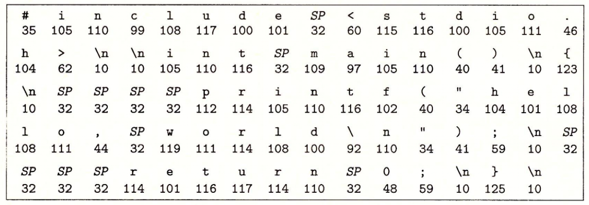
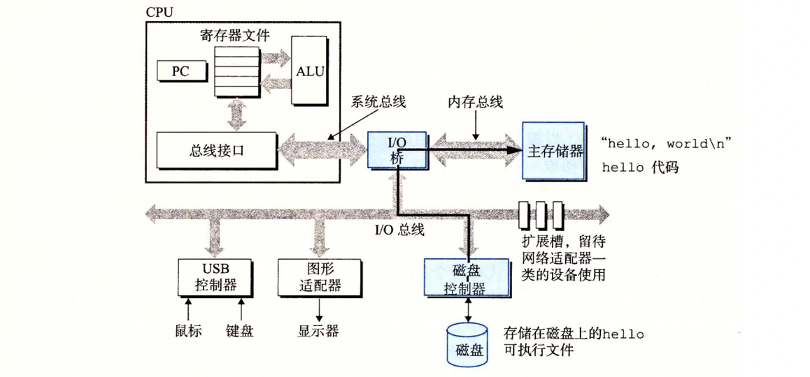
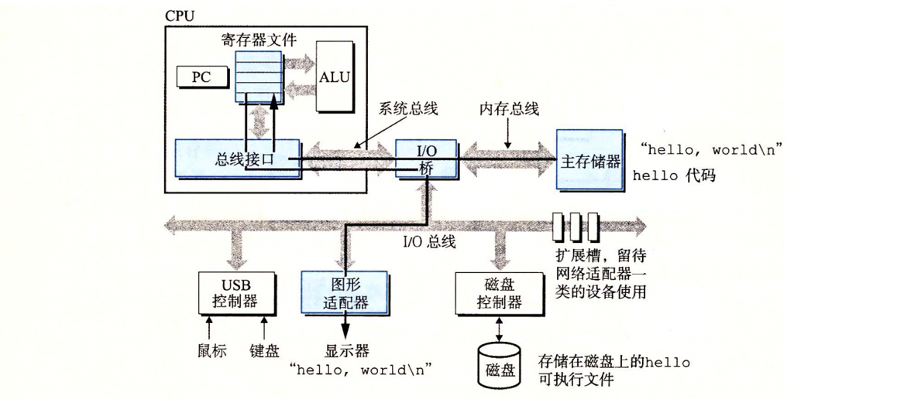

# GCC介绍

## GCC简介

GCC 官方文档网站：https://gcc.gnu.org/onlinedocs/

GCC 是 GNU项目的一个产品。GCC（GNU Compiler Collection，GNU编译程序集合）是最重要的开放源码软件。其他所有开放源码软件都在某种层次上依赖于它。甚至其他语言，例如 Python，都是由 C 语言开发的，由 GNU 编译程序编译的。

## GCC常见组成部分

**c++：** gcc 的一个版本，默认语言设置为 C++，而且在链接的时候自动包含标准 C++ 库。这和 g++ 一样 

**g++：** gcc 的一个版本，默认语言设置为 C++，而且在链接的时候自动包含标准 C++库。这和 c++ 一样

**gcc：** 该驱动程序等同于执行编译程序和连接程序以产生需要的输出

**configure：** GCC 源代码树根目录中的一个脚本。用于设置配置值和创建 GCC 编译程序必需的 make 程序文件

**libgcc：** 该库包含的例程被作为编译程序的一部分，是因为它们可被链接到实际的可执行程序中。它们是特殊的例程，链接到可执行程序，来执行基本的任务，例如浮点运算。这些库中的例程通常都是平台相关的

**libstdc++：** 运行时库，包括定义为标准语言一部分的所有的 C++类和函数

## GCC包含的常见软件

**ar：** 这是一个程序，可通过从文档中增加、删除和析取文件来维护库文件。通常使用该工具是为了创建和管理连接程序使用的目标库文档。该程序是 binutils 包的一部分

**as：** GNU 汇编器。实际上它是一族汇编器，因为它可以被编译或能够在各种不同平台上工作。该程序是 binutjls 包的一部分

**ld：** GNU 连接程序。该程序将目标文件的集合组合成可执行程序。该程序是 binutils 包的一部分

**libtool：** 一个基本库，支持 make 程序的描述文件使用的简化共享库用法的脚本

**make：** 一个工具程序，它会读 makefile 脚本来确定程序中的哪个部分需要编译和连接，然后发布必要的命令。它读出的脚本（叫做 makefile 或 Makefile）定义了文件关系和依赖关系

**gdb：** GNU 调试器，可用于检查程序运行时的值和行为

## GCC默认头文件搜索路径

查看命令

```shell
echo | gcc -xc -v -E -
echo | gcc -xc++ -v -E -
```

# 简单编译原理

## hello.c在计算机的表示

源程序 hello.c 实际上就是一个由值 0 和 1组成的位（又称为比特）序列，8 个位被组织成一组，称为字节。每个字节表示程序中的某些文本字符

大部分计算机使用 ASCII 标准来表示文本字符

- 用一个唯一的单字节大小的整数值息来表示每个字符
- hello.c 程序是以字节序列的方式储存在文件中的

hello.c 的表示方法说明了一个基本思想∶ 系统中所有的信息——包括磁盘文件、内存中的程序、内存中存放的用户数据以及网络上传送的数据，都是由一串比特表示的



## hello.c的编译过程

GCC 编译器读取源程序文件 hello.c，并把它翻译成一个可执行目标文件 hello。这个翻译过程可分为四个阶段完成，如下图所示


执行这四个阶段的程序（预处理器、编译器、汇编器和链接器）一起构成了编译系统（compilation system）

### 预处理阶段

`预处理器（cpp）`根据以字符#开头的命令，修改原始的 C 程序。比如 hello.c中第 1行的#include < stdio.h>命令告诉预处理器读取系统头文件 stdio.h 的内容，并把它直接插入程序文本中。结果就得到了另一个 C程序，通常是以.i作为文件扩展名。

### 编译阶段

`编译器（ccl）`将文本文件 hello.i翻译成文本文件 hello.s，它包含一
个汇编语言程序。该程序包含函数 main 的定义，如下所示：

```
            main:
            subq    $8, %rsp 
            mov1    $.LCO,%edi 
            call    puts 
            mov1    $0,%eax 
            addq    $8,%rsp 
            ret
```

每条语句都以一种文本格式描述了一条低级机器语言指令。汇编语言非常有用，它为不同高级语言的不同编译器提供了通用的输出语言

这个步骤看起来没那么重要，但在涉及到一些关于性能问题的时候，是需要看它的。我之前有问过一个技术大牛，我写的代码对比别人的代码，到底谁的性能好，他说很简单，你把它转换成汇编语言就可以了，就看它有多少条指令，因为计算机是一条一条指令去执行的

### 汇编阶段

`汇编器（as）`将 hello.s 翻译成机器语言指令，把这些指令打包成一种叫做可重定位目标程序（relocatable object program）的格式，并将结果保存在目标文件 hello.o中。

hello.o 文件是一个二进制文件，它包含的17 个字节是函数 main的指令编码。如果我们在文本编辑器中打开 hello.o文件，将看到一堆乱码。

### 链接阶段

注意，hello程序调用了 printf 函数，它是每个 C 编译器都提供的标准 C 库中的一个函数。printf 函数存在于一个名为 printf.o 的单独的预编译好了的目标文件中，而这个文件必须以某种方式合并到我们的 hello.o 程序中。

`链接器（ld）`就负责处理这种合并。结果就得到 hello 文件，它是一个可执行目标文件（或者简称为可执行文件），可以被加载到内存中，由系统执行。

## hello程序的执行过程

### 第一步

- shell 等待我们输入一个命令
- 当我们在键盘上输入字符串"./hello"（注意这里是编译好的可执行目标文件）后
- shell 程序将字符逐一读入寄存器
- 再把它存放到内存中  


### 第二步  

- 当我们在键盘上敲回车键时，shell 程序就知道我们已经结束了命令的输人
- 然后 shell 执行一系列指令来加载可执行的 hello 文件
- 这些指令将 hello 目标文件中的代码和数据从磁盘复制到主存
- 数据包括最终会被输出的字符串"hello，world\n"。



### 第三步

- 一旦目标文件 hello 中的代码和数据被加载到主存
- 处理器就开始执行 hello 程序的 main 程序中的机器语言指令
- 这些指令将 "hello，world\n" 字符串中的字节从主存复制到寄存器文件
- 再从寄存器文件中复制到显示设备，最终显示在屏幕上



## 程序在计算机内的存储

上面的例子揭示了一个重要的问题，即系统“似乎”花费了大量的时间和步骤把信息从一个地方挪到另一个地方

- hello程序的机器指令最初是存放在磁盘上   
- 当程序加载时，它们被复制到主存
- 当处理器运行程序时，指令又从主存复制到处理器

相似地，数据串 "hello，world\n"开始时在磁盘上，然后被复制到主存，最后从主存上复制到显示设备

# Makefile

## 基本格式

```makefile
目标项:依赖项
[tab]具体指令
```

## 伪目标

有时会出现这么一种情况，比如，你的目标项叫clean，你在makefile里写好了相关命令，如

```makefile
clean:
	$(RM) *.o target_name -r
```

但是跟makefile同级路径下有一个文件它也叫clean，这时，你去make clean，上述指令就不会生效

为了避免和文件重名的这种情况，我们可以使用一个特殊的标记 `.PHONY` 来显示地指明一个目标是“伪目标”，向 make 说明，不管是否有这个文件，这个目标就是 "伪目标"

```makefile
clean:
	$(RM) *.o target_name -r
.PHONY:clean
```

只要有`.PHONY:clean`这个声明，不管是否有“clean”文件，你make clean都会执行clean这个目标

## 变量

### 变量的定义

变量在声明时需要给予初值，用=或者:=都行

```makefile
cpp := main.cpp 
obj := main.o
```

### 变量的引用

变量在使用时，需要给在变量名前加上 `$` 符号，并用小括号 `()` 或者花括号`{}`把变量给包括起来

```makefile
cpp := main.cpp 
obj := main.o

$(obj) : ${cpp}
  @g++ -c $(cpp) -o $(obj)

compile : $(obj)
```

加个@是为了将执行的命令隐藏起来，不在终端上显示

### 预定义变量

- `$@`: 目标(target)的完整名称
- `$<`: 第一个依赖文件（prerequisties）的名称
- `$^`: 所有的依赖文件（prerequisties），以空格分开，不包含重复的依赖文件

```makefile
cpp := main.cpp 
obj := main.o

$(obj) : ${cpp}
	@g++ -c $< -o $@
	@echo $^

compile : $(obj)

clean:
	@rm -rf *.o

debug:
	@echo $(cpp)
	@echo $(obj)

.PHONY : clean debug
```

## 常用符号

### =

- 简单的赋值运算符
- 用于将右边的值分配给左边的变量
- 如果在后面的语句中重新定义了该变量，则将使用新的值

```makefile
HOST_ARCH   = aarch64
TARGET_ARCH = $(HOST_ARCH)

# 更改了变量 a
HOST_ARCH   = amd64

debug:
	@echo $(TARGET_ARCH)
```

make debug后，输出是amd64

### :=

- 立即赋值运算符
- 用于在定义变量时立即求值
- 该值在定义后不再更改，即使在后面的语句中重新定义了该变量
- 有弹幕说，:=相当于直接赋值，=相当于赋地址或指针

```makefile
HOST_ARCH   := aarch64
TARGET_ARCH := $(HOST_ARCH)

# 更改了变量 a
HOST_ARCH := amd64

debug:
	@echo $(TARGET_ARCH)
```

make debug后，输出还是aarch64

### ?=

- 默认赋值运算符
- 如果该变量已经定义，则不进行任何操作
- 如果该变量尚未定义，则求值并分配

```makefile
HOST_ARCH  = aarch64
HOST_ARCH ?= amd64

debug:
    @echo $(HOST_ARCH)
```

make debug后，输出是aarch64，如果把第一行注释掉，那输出就是amd64

### +=

- 累加运算符

```makefile
include_paths := src
CXXFLAGS := -m64 -fPIC -g -O0 -std=c++11 -w -fopenmp
CXXFLAGS += $(include_paths)

debug:
	@echo $(CXXFLAGS)
```

make debug后，输出是-m64 -fPIC -g -O0 -std=c++11 -w -fopenmp src

### \

* 续行符

```makefile
LDLIBS := cudart opencv_core \
          gomp nvinfer protobuf cudnn pthread \
          cublas nvcaffe_parser nvinfer_plugin 
```

### *

- `*`: 通配符表示匹配任意字符串，可以用在目录名或文件名中

### %

- `%`: 通配符表示匹配任意字符串，并将匹配到的字符串作为变量使用

## 常用函数

### shell

```makefile
$(shell <command> <arguments>)
```

- 名称：shell 命令函数 —— shell
- 功能：调用 shell 命令 command
- 返回：函数返回 shell 命令 command 的执行结果

```makefile
# shell 指令，src 文件夹下找到 .cpp 文件
cpp_srcs := $(shell find src -name "*.cpp")

debug :
	@echo $(cpp_srcs)

.PHONY : debug
```

make debug之后就会显示src下的所有cpp文件

```makefile
# shell 指令, 获取计算机架构
HOST_ARCH := $(shell uname -m)

debug :
	@echo $(HOST_ARCH)

.PHONY : debug
```

make debug之后就会显示当前计算机的架构

### subst

```makefile
$(subst <from>,<to>,<text>)
```

- 名称：字符串替换函数——subst
- 功能：把字串 \<text> 中的 \<from> 字符串替换成 \<to>
- 返回：函数返回被替换过后的字符串

```makefile
cpp_srcs := $(shell find src -name "*.cpp")
cpp_objs := $(subst src/,objs/, $(cpp_srcs))
cpp_objs := $(subst .cpp,.o, $(cpp_objs))

debug :
	@echo $(cpp_srcs)
	@echo $(cpp_objs)

.PHONY : debug
```

第一行会找到src下所有的cpp文件

第二行会把第一行得到的字符串中的src替换成objs

第三行会在第二行的基础上把字符串中的.cpp替换成.o

### patsubst

```makefile
$(patsubst <pattern>,<replacement>,<text>)
```

- 名称：模式字符串替换函数 —— patsubst
- 功能：通配符 `%`，表示任意长度的字串，从 text 中取出 patttern， 替换成 replacement
- 返回：函数返回被替换过后的字符串

```makefile
cpp_srcs := $(shell find src -name "*.cpp")
cpp_objs := $(patsubst src/%.cpp,objs/%.o, $(cpp_srcs))

debug :
	@echo $(cpp_srcs)
	@echo $(cpp_objs)

.PHONY : debug
```

上面的subst完成两处替换需要两行指令，而用patsubst只需要一行指令

### foreach

```makefile
$(foreach <var>,<list>,<text>)
```

- 名称：循环函数——foreach。
- 功能：把字串\<list>中的元素逐一取出来，执行\<text>包含的表达式
- 返回：\<text>所返回的每个字符串所组成的整个字符串（以空格分隔）

```makefile
include_paths := /usr/include \
				 /usr/include/opencv2/core

library_paths := /datav/shared/100_du/03.08/lean/protobuf-3.11.4/lib \
                 /usr/local/cuda-10.1/lib64

include_paths := $(foreach item,$(include_paths),-I$(item))

library_paths := $(foreach item,$(library_paths),-I$(item))

debug :
	@echo $(include_paths)
	@echo $(library_paths)

.PHONY : debug
```

相当于会把include_paths和library_paths中的所有字符串前面都添加上I

也可以用下面这种方式实现同等效果

```makefile
include_paths := /usr/include \
				 /usr/include/opencv2/core

library_paths := /datav/shared/100_du/03.08/lean/protobuf-3.11.4/lib \
                 /usr/local/cuda-10.1/lib64

I_flag := $(include_paths:%=-I%)

L_flag := $(library_paths:%=-L%)

debug :
	@echo $(I_flag)
	@echo $(L_flag)

.PHONY : debug
```

### dir

```makefile
$(dir <names...>)
```

- 名称：取目录函数——dir。
- 功能：从文件名序列<names>中取出目录部分。目录部分是指最后一个反斜杠（“/”）之前
  的部分。如果没有反斜杠，那么返回“./”。
- 返回：返回文件名序列<names>的目录部分。

```makefile
cpp_srcs := $(shell find src -name "*.cpp")
cpp_objs := $(patsubst src/%.cpp,objs/%.o, $(cpp_srcs))

objs/%.o : src/%.cpp
	@mkdir -p $(dir $@)
	@g++ -c $^ -o $@
	
compile : $(cpp_objs)

debug :
	@echo $(cpp_srcs)
	@echo $(cpp_objs)

.PHONY : debug compile
```

若当前没有objs这个目录，而且没有`@mkdir -p $(dir $@)`这一句，就会报错，加上这一句后，不管当前你有没有objs这个目录，都不会报错，我会自动创建

### notdir

```makefile
$(notdir <names...>)
```

* 功能：从文件名序列<names>中取出除目录以外的部分，也就是最后一个反斜杠（“/”）之后的部分

### filter

```makefile
$(filter <condition>,<names...>)
```

- 功能：从文件名序列<names>中过滤出满足<condition>的部分

### filter-out

```makefile
$(filter <condition>,<names...>)
```

- 功能：从文件名序列<names>中剔除<condition>的部分

### basename

```makefile
$(basename <names...>)
```

- 功能：去掉文件名序列<names>中所有文件的后缀

```makefile
libs    := $(notdir $(shell find /usr/lib -name lib*))
a_libs  := $(subst lib,,$(basename $(filter %.a,$(libs))))
so_libs := $(subst lib,,$(basename $(filter %.so,$(libs))))

debug :
	@echo $(libs)
	@echo $(a_libs)
	@echo $(so_libs)

.PHONY : debug
```

# 编译

## 编译过程

```makefile
cpp_srcs := $(shell find src -name *.cpp)
cpp_objs := $(patsubst src/%.cpp,objs/%.o,$(cpp_srcs))

objs/%.o : src/%.cpp
	@mkdir -p $(dir $@)
	@g++ -c $^ -o $@

workspace/exec : $(cpp_objs)
	@mkdir -p $(dir $@)
	@g++ $^ -o $@

run : workspace/exec
	@./$<

clean :
	@rm -rf objs workspace

debug :
	@echo $(cpp_objs)

.PHONY : debug run clean
```

## 编译和链接选项

### 编译选项

- `-m64`: 指定编译为 64 位应用程序
- `-std=`: 指定编译标准，例如：-std=c++11、-std=c++14
- `-g`: 包含调试信息
- `-w`: 不显示警告
- `-O`: 优化等级，通常使用：-O3
- `-I`: 加在头文件路径前
- `fPIC`: (Position-Independent Code), 产生的没有绝对地址，全部使用相对地址，代码可以被加载到内存的任意位置，且可以正确的执行。这正是共享库所要求的，共享库被加载时，在内存的位置不是固定的

### 链接选项

- `-l`: 加在库名前面
- `-L`: 加在库路径前面
- `-Wl,<选项>`: 将逗号分隔的 <选项> 传递给链接器
- `-rpath=`: "运行" 的时候，去找的目录。运行的时候，要找 .so 文件，会从这个选项里指定的地方去找

## 约定俗成的变量名

- CC: Program for compiling C programs; default cc
- CXX: Program for compiling C++ programs; default g++
- CFLAGS: Extra flags to give to the C compiler
- CXXFLAGS: Extra flags to give to the C++ compiler
- CPPFLAGS: Extra flags to give to the C preprocessor
- LDFLAGS: Extra flags to give to compilers when they are supposed to invoke the linker

## 编译带头文件的程序

>add.hpp

```c++
#ifndef ADD_HPP
#define ADD_HPP
int add(int a, int b);

#endif // ADD_HPP
```

>add.cpp

```c++
int add(int a, int b)
{
    return a+b;
}
```

>minus.hpp

```c++
#ifndef MINUS_HPP
#define MINUS_HPP
int minus(int a, int b);

#endif // MINUS_HPP
```

>minus.cpp

```c++
int minus(int a, int b)
{
    return a-b;
}
```

>main.cpp

```c++
#include <stdio.h>
#include "add.hpp"
#include "minus.hpp"

int main()
{
    int a=10; int b=5;
    int res = add(a, b);
    printf("a + b = %d\n", res);
    res = minus(a, b);
    printf("a - b = %d\n", res);

    return 0;
}
```

>Makefile

```makefile
cpp_srcs := $(shell find src -name *.cpp)
cpp_objs := $(patsubst src/%.cpp,objs/%.o,$(cpp_srcs))

# 你的头文件所在文件夹路径（建议绝对路径）
include_paths := /usr/include \
				 include
I_flag        := $(include_paths:%=-I%)

compile_options := -g -O3 -w -$(I_flags)

objs/%.o : src/%.cpp
	@mkdir -p $(dir $@)
	@g++ -c $^ -o $@ $(compile_options)

workspace/exec : $(cpp_objs)
	@mkdir -p $(dir $@)
	@g++ $^ -o $@ 

run : workspace/exec
	@./$<

debug :
	@echo $(compile_options)

clean :
	@rm -rf objs workspace/exec

.PHONY : debug run clean
```

## 编译并链接静态库

```makefile
lib_srcs := $(fileter-out src/main.cpp,$(shell find src -name *.cpp))
lib_objs := $(patsubst src/%.cpp,objs/%.o,$(lib_srcs))

include_paths := ./include

library_paths := ./lib

linking_libs := xxx

I_options := $(include_paths:%=-I%)
L_options := $(library_paths:%=-L%)
l_options := $(linking_libs:%=-l%)

compile_flags := -g -O3 -std=c++11 $(I_options)
linking_flags := $(L_options) $(l_options)

# ==================== 编译静态库 ======================
objs/%.o : src/%.cpp
	@mkdir -p $(dir $@)
	@g++ -c $^ -o -$@ $(compile_flags)
	
lib/libxxx.a : $(lib_objs)
	@mkdir -p $(dir $@)
	@ar -r $@ $^
	
static_lib : lib/libxxx.a

# ==================== 链接静态库 ======================
objs/main.o : src/main.cpp
	@mkdir -p $(dir $@)
	@g++ -c $^ -o $@ $(compile_flags)
	
workspace/exec : objs/main.o
	@mkdir -p $(dir $@)
	@g++ $^ -o $@ $(linking_flags)

run : workspace/exec
	@./$<


debug:
	@echo $(lib_srcs)
	@echo $(lib_objs)

clean :
	@rm -rf objs
	
.PHONY : debug static_lib
```

这里应该是有一个先后顺序的，先make static_lib编译出静态库，然后再make run链接静态库，并执行

## 编译并链接动态库

```makefile
lib_srcs := $(shell find src -name "*.cpp")
lib_objs := $(patsubst src/%.cpp,objs/%.o,$(lib_srcs))

include_paths := ./include

library_paths := ./lib

linking_libs := xxx

linking_paths := /lib/x86_64-linux-gnu/

I_options := $(include_paths:%=-I%)
L_options := $(library_paths:%=-L%)
l_options := $(linking_libs:%=-l%)

compile_flags := -g -O3 -std=c++11 $(I_options)
linking_flags := $(L_options) $(l_options)

# ==================== 编译动态库 ======================
# 法1：分开做
#objs/%.o : src/%.cpp
#	@mkdir -p $(dir $@)
#	@g++ -c $^ -o $@ $(compile_flags)

#lib/libxxx.so : $(lib_objs)
#	@mkdir -p $(dir $@)
#	@g++ $^ -o $@ -fPIC -shared

# 法2：合一块做
lib/libxxx.so : $(lib_srcs)
	@mkdir -p $(dir $@)
	@g++ $^ -o $@ -fPIC -shared $(compile_flags) 

shared_lib : lib/libxxx.so
	@cp lib/libxxx.so $(linking_paths)

# ==================== 链接动态库 ======================
main.o : main.cpp
	@g++ -c $^ -o $@ $(compile_flags)

workspace/exec : main.o
	@mkdir -p $(dir $@)
	@g++ $^ -o $@ $(linking_flags)

run : workspace/exec
	@./$<


debug :
	@echo $(lib_srcs)
	@echo $(lib_objs)

clean :
	@rm -rf objs main.o lib

.PHONY : debug shared_lib
```

这里也应该是有一个先后顺序的，先make shared_lib编译出静态库，然后再make run链接静态库，并执行，由于make shared_lib那块需要把so拷贝到`/lib/x86_64-linux-gnu/`路径下，所以需要加上sudo

